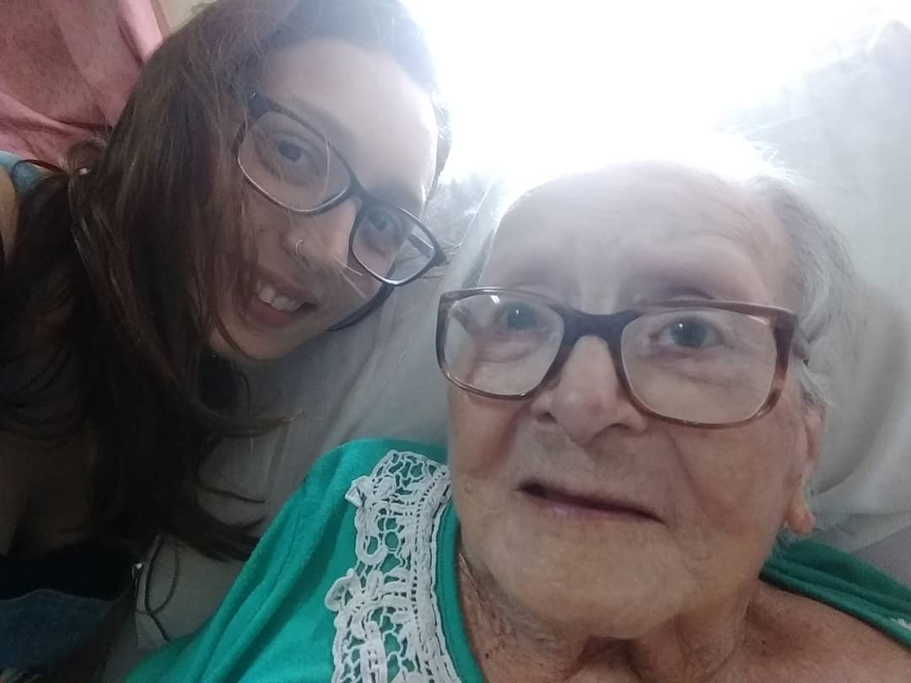

Apoyo la cara en el brazo izquierdo de mi abuela, que me acaricia el pelo casi como acto reflejo. Sentadas a la mesa del comedor de mi casa de siempre me refriego la cara en ese brazo, como hacen mis gatos conmigo unos cuantos -casi veinte- años más acá. Me parece la mejor sensación del mundo, y se lo digo. *'No entiendo cómo te pueden gustar estos brazos flácidos de vieja'* me contesta y sigue haciendo el mate. No me importa, yo tampoco entiendo cuál es el problema con los brazos de mi abuela. Casi a modo de disculpa siempre aclaro que tengo una memoria terrible, desastrosa, no retengo nada. Pero si hay algo que no se me va es el olor de la piel en los brazos de mi abuela. Me pasa lo mismo con una sensación todavía más vaga, de mí a los 4 o 5 años en la cama con mi mamá, y de nuevo el olor de su piel que es lo mejor del mundo. 

Me pasa ahora que estando lejos lo que extraño también son olores, y lo que más rápidamente detecto cuando llego a algún lugar nuevo también es el olor. Beijing fue ácida, penetrante, casi que dolía adentro de la nariz; Mumbai fue humo de fuegos artificiales y humedad, un olor a árboles y hojas y pasto y a comida de una familiaridad que me desorientó por completo; Ginebra no huele a nada y me enloquece con su falta de impronta, quizás no estoy lo suficientemente madura para detectarla todavía. 

Hace poco estuve en mi casa y lo que más me impactó fue darme cuenta que ya no tenía el mismo olor que yo recordaba. Me dejó estúpida por unos dos o tres días, pero por suerte hacia afuera siempre está la excusa del jet lag. ¿Qué es lo que le da esa huella casi imperceptible a una casa? ¿Son las comidas que se preparan, la gente que la habita, los perros o los gatos que la pasean y le tiran pelos? 

Limpiá, limpiemos todo: que el olor a una 'primavera' fabricada en Aldo Bonzi despiste nuestra huella en los pisos, en los patios. Nadie cuenta el daño que la industria de la limpieza le hace a la historia familiar de todos nosotros.

Habiendo perdido la huella olfativa de mi casa y con el pudor idiota de los años que me impide acercarme a los cuerpos como antes (o quizás por el miedo a sentir que también su huella, la de mi mamá, había cambiado), decidí ir al encuentro de mi abuela. No resulta una empresa demasiado complicada porque siempre está en el mismo lugar, una casa de ancianos en Villa Adelina del otro lado de la General Paz. Me gusta mucho ese contraste entre el conurbano donde recién empieza y la capital que termina. En esa zona al menos, los jardines de la General Paz le dan al límite un ambiente de río, cinta plateada de día, alquitrán de noche, que se va transmutando en árboles y pasto y autos abandonados llenos de óxido. Habiendo crecido en un barrio de capital al que le dicen 'Jardín de Buenos Aires', los árboles del conurbano, más petisos, con sus bases pintadas de cal y sus hojas carnosas me resultaron siempre mucho más atractivos que los plátanos de este otro lado. Los jacarandáes devotenses y su lluvia de violetas son estéticamente impecables, pero los árboles de naranjas en las veredas de Ciudadela siempre me alucinaron: el naranjo es un árbol que además de existir, se puede comer. No necesitaríamos mucho más.

Volviendo, un geriátrico tiene muchos olores: a productos de limpieza, al alcohol de las enfermeras, a comida genérica, a remedios, a cremas que evitan que el cuerpo -fijo tanto tiempo en una misma posición- se empiece a gastar. Quizás de eso está hecho el famoso 'olor a viejo', aunque quizás no, y sea sólo otra expresión de la resequedad del espíritu. Ya me enteraré. La cuestión es que al principio me costaba mucho el encuentro con mi abuela en ese contexto, pero porque todavía pensaba que era ella. Con los años y el avance de la enfermedad me di cuenta que aunque hay un poco de ella ahí, es más lo que no hay, y que no podría estar en otro lugar mejor. Me sumé a mi mamá y mi tía, que van todos los viernes a la noche, mi abuela estaba un poco más irritable que de costumbre. Como siempre, tarda en reconocerme pero al final lo hace; como siempre, me impacta verle el pelo lacio en lugar de los peinados altos que llevaba siempre. Si la vejez está hecha de obsesiones, entonces mi abuela es idealmente vieja: lo que más le preocupa constantemente es que le digan por qué no le llevamos aros o anillos nuevos, y sufre, sufre por eso. En la mesa donde estamos todas sentadas se nos suma una señora con menos suerte que mi abuela, contenta. Me repite que yo soy muy linda cada dos o tres minutos, le digo que muchas gracias. Tiene el cuerpo más inútil que la cabeza lúcida, nos agradece muchas veces que estemos ahí antes de irse a dormir. Mientras se va me sorprende darme cuenta cómo estas cosas ya no me destrozan.

Es hora de que mi abuela también se vaya a dormir, así que pasamos a la habitación. Antes de irnos me mira y me sonríe y me dice que yo soy muy linda. Le digo que ella también, y protesta: *'Qué decís, soy una vieja horrible'*. No, le digo, no. Me pregunta por qué no dejamos que se muera, que ella se quiere morir. Le digo que no sé como hacerlo, que si pudiera lo haría pero que de verdad no sé, y me devuelve un gesto frustrado. A mí también me frustra mucho no saber qué hacer. 

Mi abuela es del 22, que cuando lo pienso y trato de imaginarme cómo era su mundo, me explota el cerebro. Nació en 1922 en Córdoba, tiene la piel más oscura y los pómulos más altos que el resto de mi familia que vino del sur de Italia, de su padre no sabemos nada y de su madre poco. Parece que plata nunca tenían pero siempre le gustaron mucho los chicos, así que cuidaba a la nena de su vecina siendo ella también una nena. Presumiblemente venían 'del norte' como decía de otra de sus amigas, la tía Victoria, una personita esmirriada, canosa, siempre con la casa llena de gente y música y en mi memoria desde siempre vieja. A veces me gusta imaginar cómo hubiera sido la historia de mi abuela si se hubiera encontrado con el feminismo, no precisamente  porque haya sido 'léida' sino porque su vida estuvo atravesada por un dechado de expresiones patriarcales de poder, una atrás de otra, que me llenan de bronca.

Estoy por irme y pienso que quiero tener una foto con mi abuela porque aunque ahora no sea ella, es el salvavidas que tengo más a mano para esta memoria de porquería que llevo a cuestas. Nos saco una selfie y se la muestro, y me grita *'Quién es esa vieja horrible? ¡Soy yo!'* y llora. Le digo que no, que la vieja soy yo y que ella es la que está al lado, que no se confunda. Se tranquiliza, la abrazo, me regalo la impunidad de refregarme contra el brazo de mi abuela de nuevo: el olor es el mismo de siempre. 

